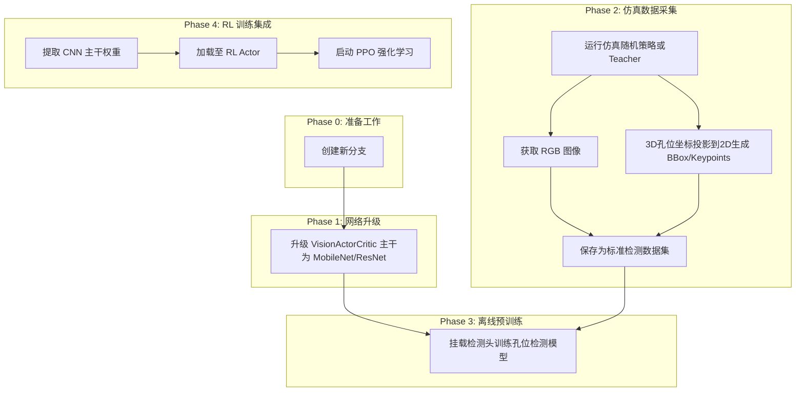

# 视觉网络升级与孔位检测预训练计划

## 核心思路

你现在的目标是**表征学习（Representation Learning）**：因为 RL 从零开始学视觉特征太难（奖励信号稀疏且充满噪声），所以先用监督学习（目标检测）让 CNN 学会“什么是托盘孔位”，然后把这个聪明的 CNN 塞给 RL Actor。

为了实现这个目标，我们需要把计划调整为以下四个阶段：

## Phase 0: 准备工作

为了不影响现有的训练主线，我们将所有改动隔离在一个新的分支中。

- **行动**：使用 git 创建并切换到新分支（例如 `feat/vision-pretrain`）。

## Phase 1: 升级 RL Actor 的 CNN 架构

当前的 `VisionActorCritic` 使用的是非常简单的 3 层卷积（NatureCNN 风格），特征提取能力有限。

- **行动**：修改 `vision_actor_critic.py`。
- **方案**：引入 `torchvision.models`，将主干替换为轻量级且强大的网络（推荐 `MobileNetV3-Small` 或 `ResNet18`）。
- **细节**：去掉分类头，保留特征图输出并 Flatten，对齐到现有的 MLP 融合层。

## Phase 2: 仿真数据与 Ground Truth 采集

这是计划中最重要的一环。仿真环境的优势在于我们可以获取绝对精确的 3D 状态。

- **行动**：编写一个独立的数据采集脚本 `scripts/collect_detection_data.py`。
- **数据源**：在 Isaac Lab 中运行叉车（可以使用随机动作，或者现有的低维 Teacher 策略让叉车在托盘附近游走）。
- **GT 生成逻辑**：
  1. 获取托盘（Pallet）在世界坐标系下的 3D Pose。
  2. 根据托盘的几何尺寸，计算出两个插入孔位中心的 3D 坐标。
  3. 获取相机的 3D Pose 和内参矩阵（Intrinsics）。
  4. 将孔位的 3D 坐标投影到 2D 图像平面，生成 2D Bounding Box（检测框）或关键点（Keypoints）。
- **输出格式**：将图像和对应的 GT 标签保存为 YOLO 格式或 COCO 格式，方便后续直接训练。

### Phase 2.1: 当前采集目标

当前计划先不追求大规模数据集，**第一阶段只采集 `5k-10k` 张图片**。

- **当前目标集**：`5k-10k` 张图片
  - 用途：验证相机视野、3D 到 2D 投影、标签格式、训练脚本，以及第一版检测模型是否能收敛
  - 对应 episode 量级：约 `20-50` 个完整 episode
  - 这是当前阶段唯一必须完成的采集目标
  - 退出条件：能稳定训练一个小模型并明显收敛；随机抽查标签无明显错框；近场孔位样本占比达标

后续扩展数据集只作为可选项，不作为当前里程碑：

- **扩展版 v0.1**：`50k-100k` 张图片
  - 触发条件：`5k-10k` 张的数据集已验证有效，但检测模型泛化仍明显不足

- **扩展版 v1.0**：`200k+` 张图片
  - 触发条件：`v0.1` 已验证有效，但迁移到 RL 后提升还不够
  - 这一规模与 `plan_student_techer` 中 `v0.1≈220K frames / v1.0≈880K frames` 的量级一致，因此工程上是可行的

### Phase 2.2: 采样单位与记录口径

这里统一用“图片数”做目标管理，但脚本实现应同时记录 `frame_count` 和 `episode_count`。

- 单位 1：`frame_count`
  - 真正用于训练检测模型的样本数
- 单位 2：`episode_count`
  - 用于控制场景覆盖和避免数据泄漏

推荐做法：

- 采集脚本按 `episode` 组织输出
- 统计时同时输出：
  - 总图片数
  - 总 episode 数
  - 每个 episode 平均图片数
  - 每个阶段的图片数

### Phase 2.3: 分阶段配额

如果不做阶段配额，最容易出现的问题是远场图片太多，而真正关键的“孔位近场识别”样本不够。

对当前这批 `5k-10k` 张图片，建议最少满足下面的阶段覆盖：

- **远场**：`20%-25%`
  - 定义参考：托盘仍较完整，主要学习整体位置与粗朝向
- **中场**：`25%-30%`
  - 定义参考：托盘开口清晰可见，开始形成孔位识别主信号
- **近场**：`30%-35%`
  - 定义参考：叉齿与孔位相对关系明显，主任务难点集中在这里
- **插入中 / 极近场**：`15%-20%`
  - 定义参考：孔位局部、叉齿进入、遮挡增加

额外约束：

- 左右偏移样本要均衡，避免只学会“基本在正中”的简单分布
- 偏航角要覆盖小角偏和大角偏，避免只学会准直场景
- 保留失败 episode，不只保留 teacher 成功轨迹

### Phase 2.4: 数据集划分

训练、验证、测试必须按 `episode` 划分，不能按单帧随机打散。

推荐划分：

- `train`: `80%`
- `val`: `10%`
- `test`: `10%`

补充要求：

- 同一个 episode 的图片不能进入不同 split
- `val/test` 里必须保留近场和插入阶段样本
- 单独导出一个 `hard_cases` 子集，专门保留大横偏、大偏航、强遮挡、极近场样本

### Phase 2.5: 采集完成判据

“采够了”不能只看图片总数，还要满足覆盖和质量约束。

当前这批 `5k-10k` 张图片的完成条件建议同时满足：

- 图片总数达到 `5k-10k`
- 至少完成 `20+` 个 episode，优先目标 `30-50` 个 episode
- 四个阶段都有样本，且没有任何一个阶段低于总量的 `15%`
- 左偏 / 右偏样本数量近似均衡
- 偏航分布覆盖训练中的主要工作范围
- 随机抽查 `200` 张图，自动投影标签没有系统性偏移
- 在 `v0.0` 上训练的小模型能够明显收敛

### Phase 2.6: 风险与缓解

采集阶段最容易出问题的地方：

- **图片能采很多，但标签系统性错位**
  - 解决：先做 `v0.0`，人工抽检投影框
- **远场图太多，近场难样本太少**
  - 解决：采集脚本内增加按阶段重采样或缓存筛选
- **只覆盖 teacher 的顺滑成功轨迹**
  - 解决：保留失败 episode，并有意识加入横偏、角偏、遮挡更强的状态
- **总数达标但泛化差**
  - 解决：检查 `hard_cases` 子集指标，而不只看总体 mAP 或 loss

## Phase 3: 离线预训练目标检测模型

使用采集到的数据集，训练一个孔位识别模型。

- **行动**：编写离线训练脚本。
- **模型结构**：为了保证权重能够 100% 无缝迁移到 RL Actor，建议直接使用 **Phase 1 中定义好的 CNN 主干**，在上面临时挂载一个简单的检测头（例如预测孔位中心的 heatmap，或者直接回归 2 个框的坐标）。
- **训练目标**：使模型能够在各种视角、光照、距离下准确框出托盘的两个孔位。

## Phase 4: 权重提取与 RL 闭环集成

检测模型收敛后，剥离其主干权重，赋能给强化学习。

- **行动**：修改 RL 训练入口。
- **加载权重**：在 `VisionActorCritic` 初始化时，读取预训练好的 `.pt` 权重文件，加载到 CNN 主干中。
- **RL 训练策略**：
  - **初期冻结（可选）**：在 PPO 训练的前 100-200 个 Iteration，冻结 CNN 的梯度（`requires_grad=False`），只训练后端的 MLP 和动作输出头，防止 RL 早期随机探索的巨大梯度破坏预训练好的视觉特征。
  - **后期解冻**：MLP 收敛后，解冻 CNN 进行联合微调（Fine-tuning）。

---

**下一步**：如果这个计划符合你的构想，请确认。确认后，我们将从 **Phase 1（升级 CNN 架构）** 和 **Phase 2（编写带 GT 投影的数据采集脚本）** 开始动手写代码。